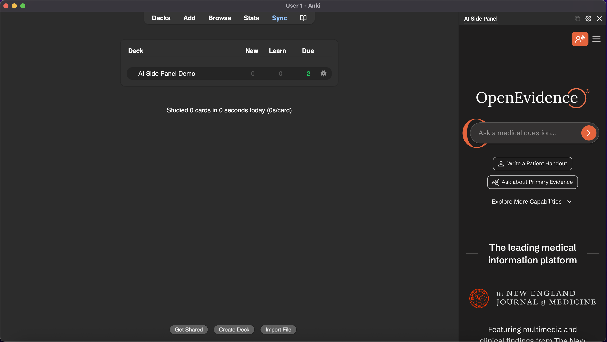
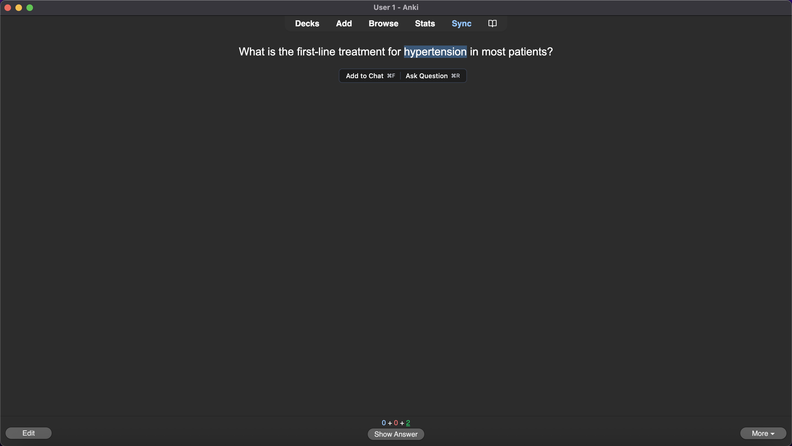

# AI Side Panel for Anki

**A 100% free AI study tool for medical students, doctors, and healthcare professionals.**
It uses OpenEvidence AI to answer your questions.

## Overview
Ask questions and get answers from real medical research. Whether you are reviewing a card or checking a drug interaction, the side panel gives you evidence-based answers inside Anki.

*   **Free** for the healthcare community.
*   **Real Citations**: Answers link to peer-reviewed sources like JAMA and PubMed.
*   **Context-Aware**: It knows what card you are studying.
*   *(Requires internet connection)*

---

## Features

### 1. Ask Questions
Open the sidebar (click the book icon) and type any medical question. You will get a detailed answer with links to the literature.

### 2. Quick Actions
You can highlight text on any card while holding `Cmd` (Mac) or `Ctrl` (Windows).

A floating bar will appear with two options:
*   **Add to Chat (`Cmd+F`)**: Sends the highlighted text to the sidebar. It is quoted as context so the AI knows what you are referring to.
*   **Ask Question (`Cmd+R`)**: Opens a box for you to ask a specific question.

---

## Customization

### Templates
Save prompts you use often. We included 3 starters:
*   **Explain**: "Can you explain this to me?"
*   **Front Only**: Sends the front of the card.
*   **Back Only**: Sends the back of the card.

### Keybinds
You can change every shortcut.
1.  Open the Side Panel.
2.  Click the **Gear Icon** > **Quick Actions**.
3.  Click any shortcut button and press your new keys.

---

## Installation

1.  Open Anki.
2.  Go to **Tools** > **Add-ons** > **Get Add-ons**.
3.  Paste the code: `1314683963`
4.  Restart Anki.
5.  Click the **Book Icon** in the toolbar to start studying.

---

## Support

Have an idea or found a bug?
*   [Feature Request](https://github.com/Lukeyp43/AI-Side-Panel/issues/new?labels=feature%20request)
*   [Bug Report](https://github.com/Lukeyp43/AI-Side-Panel/issues/new?labels=bug)